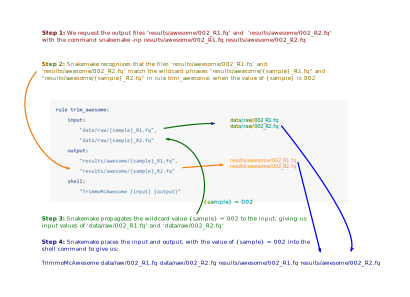

# Managing Workflows with Snakemake

In the preceding sections we have covered a few approaches for using RStudio 
projects and RMarkdown to create reproducible research repositories with visually
pleasing HTML outputs that can help readers quickly see what was required to
generate different figures/tables/outputs. Such an approach
is well suited to projects that are undertaken primarily on one's own desktop or
laptop computer, and which don't take an inordinately long time to run.  Unfortunately,
that does not describe most _bioinformatic_ analyses handling whole-genome sequencing
or RAD sequencing data for conservation genetics.  Most of those analyses will be
run on a university computer cluster, and trying to manage all of that within
an RMarkdown-based framework is at best rather difficult, and at worst it can
become a shrieking horror.  

For managing these sorts of bioinformatic workflows there is a Python-based
framework called [Snakemake](https://snakemake.readthedocs.io/en/stable/)
that is well-supported, flexible, and incredibly powerful.
Understanding how Snakemake works and becoming familiar with its many
features involves a non-trivial learning curve; however, for anyone spending
a sizable chunk of their graduate career managing bioinformatic analyses, or for anyone that is
a lab bioinformatician running bioinformatic workflows across
many species (for example), the benefits of learning
Snakemake will continue to pay dividends for years to come. 


Someone who has mastered all the topics in Part I of this handbook (Unix programming,
working on remote computers, etc.) certainly will have the skills to write
what I will call _input-oriented_, _forward-marching_ workflows. I call these
"forward-marching" because they start from a set of
input files (for example files of sequences from a sequencer), and then
the workflow is defined as a series of sequential steps, one after the other.
They are "input-oriented" in the sense that such a workflow starts
with a series of inputs, but the workflow itself doesn't really know
what it is trying to produce from those inputs until it has run all the
way through and actually turned those inputs into outputs.
For example, all the input
files might get trimmed or cleaned, then they would all get mapped to a genome,
and then those mapped sequences would be used to call variants, so as to
find SNPs in the data, etc.  If you were writing this in an
input-oriented, forward-marching fashion, then, to deal with the fact that you had multiple files of
DNA sequences (for example, one for each individual bird or fish that had
been sampled), you might write Unix `for` loops to cycle over all the input files
as in Section&nbsp;\@ref(unix-for-loops), or, you could define a SLURM job array to start a separate job
instance for each input file, as in Section&nbsp;\@ref(slurm-job-arrays).  In each case, 
you would have to do some extra programming to deal with the different input files, and
if one of the steps of your workflow failed on just one, or a few, of the files,
you might spend a large amount of time tracking those failures down and than
manually re-running that small number of jobs.  

By contrast, Snakemake takes a different approach to managing workflows.
We will call it an _output-oriented_, _backward-looking_ approach. We call it
that because workflows in Snakemake are defined first and foremost in terms of the _output files_
that are desired, along with instructions on how to create those output files
from necessary input files and bioinformatic programs.  They are _backward-looking_
in the sense that, once you have developed a Snakemake workflow, you get results by
telling Snakemake which output files you
want to create, and then it "looks backwards" through the workflow to determine which
input files are needed to create the requested outputs.  Sometimes it has to look backwards
through several steps before it identifies all the necessary input files.
Once it has found those necessary inputs, it then runs forward through the steps to
create the output files. In this phase, the workflow looks like it is "forward-marching", in the
sense that outputs are being created from inputs.  But, in order to get to that
"forward-running" phase, Snakemake had to look backward to figure out what inputs to use.

The above constitutes some subtle points, that might not be clear upon first reading,
but we will try to summarize it in a few pithy phrases:

- A workflow defined as a typical Unix shell script can be thought of as a process that runs
forward. You give it a lot of input files and it just cranks through a bunch of steps until
the output files are made.
- A workflow defined with Snakemake works differently. First you define the workflow in terms
of a series of "rules." Then, when you request any given set of output files, Snakemake
will look backwards through
the rules of the workflow and figure out exactly which steps must be performed, on which input
files, in order to create the requested output files. Once it has determined that,
it runs just those necessary steps.  

There are many advantages to this output-oriented, backward-looking approach:

1. If your workflow has many steps, and some of them have already been run,
then Snakemake automatically recognizes that, and will not re-run steps
in the workflow that have already been completed. In an input-oriented system (like
a traditional Unix script), you would have to spend the time to figure out
which steps had already been run, and then run your script only from that
point forward.  Doing so can be a hassle and can also be prone to errors.
2. A workflow defined by Snakemake, being explicit about the inputs needed
for each step, naturally defines "work units" that can be run independently of
one another.  Accordingly, Snakemake, itself, can break a huge bioinformatic workflow
into a number of small jobs that can be run in parallel, saving you, the user,
from having to write scripts to launch a series of SLURM job arrays.
3. The fact that Snakemake automatically keeps track of which inputs already
exist---and which might still need to be generated---provides huge benefits when some of your jobs fail. 
Anyone who has used a cluster has stories about jobs that inexplicably fail.  Without a workflow 
management system like Snakemake, you can spend almost as much of your own time managing these
failed jobs as it took to launch all the jobs in the first place.

In addition to these obvious advantages of the output-oriented approach, Snakemake also
includes a number of features that make it easy to use your workflow on a variety of
different platforms.  It is tightly integrated with conda (Section&nbsp;\@ref(miniconda)),
letting the user define
conda environments for each step in the workflow.  This means that if you move your whole
workflow to a new cluster, you don't have to spend any time coordinating the installation
of the programs you need---if you set things up properly with Snakemake and conda,
that will happen automatically.
If you distribute your workflows to other people to use, this is particularly helpful, since
you will spend far less time assisting them in setting up their computer environment to run
your workflow. Snakemake can also be customized to work in your own cluster environment.  Finally,
there are interfaces to allow your Snakemake workflows to run seamlessly in the cloud.  

Full  documentation for Snakemake can be found at
[https://snakemake.readthedocs.io/en/stable/](https://snakemake.readthedocs.io/en/stable/).
This documentation is comprehensive, but can feel a little daunting at first.
On the other hand, the developers of Snakemake also provide an excellent and accessible
tutorial at
[https://snakemake.readthedocs.io/en/stable/tutorial/tutorial.html](https://snakemake.readthedocs.io/en/stable/tutorial/tutorial.html).
If you have not run through that tutorial yet, you should do that before
going through the next sections in this chapter.

In the following I present another short tutorial that focuses a little more
on understanding how _wildcards_ in Snakemake work, as this seems to be a
stumbling block for many students.  In addition, I try to offer a few tidbits
of advice regarding _input functions_ and simple ways to work interactively with
Python while you are developing your Snakemake workflows.  I hope this will be particularly
helpful for students that aren't super familiar with Python.

Before proceeding, you will need to follow the instructions
[here](https://snakemake.readthedocs.io/en/stable/getting_started/installation.html#installation-via-conda) to install Snakemake into a conda environment named `snakemake`.
Once installed, activate the `snakemake` environment and then add the `tree` Unix utility to
it:
```sh
conda activate snakemake
conda install -c conda-forge tree
```
`tree` is a utility that we will use in the following. It
provides a nice way of visualizing directories and their contents.

Once you have done that, make a directory called `smk-tut` and
`cd` into it to do this tutorial.
```sh
mkdir smk-tut
cd smk-tut
```

## A Simple Snakemake Example

Here is a somewhat make-believe example that will let us grok out the
basics of Snakemake and the logic of simple workflows without worrying about
performing actual operations (like trimming or mapping) on files.  This is
a useful excercise because it can also be helpful when you are developing
your own complex workflows to first make sure that the workflow logic (from
Snakemake's point of view) is correct, without having to spend a long
time on the actual processing of files.

We will pretend that we have paired-end sequence files from a sequencing center and
we want to compare the outcome of using two different programs to trim leftover adapters
and low-quality sequence from these files.  These two (utterly fictitious) programs
are `TrimmoMcAwesome` and `trim_stupendous`^[The astute reader will note that these names are similar
to the actual programs `Trimmomatic` and `trim_galore`.  Just having some fun...].
We will pretend that both `TrimmoMcAwesome` and `trim_stupendous` work with this sort of syntax:
```sh
TrimmoMcAwesome file_read1.fq file_read2.fq outpath1  outpath2
# or
trim_stupendous file_read1.fq file_read2.fq outpath1  outpath2
```
which will trim the paired-end reads `file_read1.fq` and `file_read2.fq` and put the
results for read1 and read2, respectively, into the files `outpath1` and `outpath2`.

For now, let us assume that we have 10 input files: 2 paired-end read files
for each of 5 samples named `001` through `005`.  Please create those files
(even though they will be empty) with this Unix command:
```sh
mkdir -p data/raw
touch data/raw/00{1..5}_R{1,2}.fq
```
Please note that the use of curly braces here is an example of "brace expansion" within
the Unix shell. You will see lots of curly braces in the upcoming material, and you should
be aware that the curly braces that you will see in Snakemake code
(in the `Snakefile` as it were) are different.  Those are typically serving the
purpose of delimiting wildcards. (Though, they have other roles within Python as well.).

Once you have done that, use `tree` to see what the directory structure in
`smk-tut` looks like:
```sh
% tree .
.
└── data
    └── raw
        ├── 001_R1.fq
        ├── 001_R2.fq
        ├── 002_R1.fq
        ├── 002_R2.fq
        ├── 003_R1.fq
        ├── 003_R2.fq
        ├── 004_R1.fq
        ├── 004_R2.fq
        ├── 005_R1.fq
        └── 005_R2.fq
```
That handy little summary shows the names of 10 files inside a directory called
`raw` inside a directory called `data`.  

### Snakefile #1: A simple rule to TrimmoMcAwesome the files from 001

If you did the tutorial, you will recall that the instructions for the workflow
go into the file, `Snakefile`.  Make a Snakefile within the `smk-tut` directory
with these contents, which give it the rule for running TrimmoMcAwesome on
the reads from sample `001`:
```yaml
rule trim_awesome:
	input: 
		"data/raw/001_R1.fq",
		"data/raw/001_R1.fq"
	output:
		"results/awesome/001_R1.fq",
		"results/awesome/001_R2.fq"
	shell:
		"TrimmoMcAwesome {input} {output}"
```
Notice that this rule takes the raw fastq files as input to TrimmoMcAwesome, and
puts the trimmed output files into a diretory `results/awesome`.

Once you have that Snakefile, you can ask snakemake to show you what it
would do if you ran it.  Give it the `-n` option (dry run) and the `-p` option
(print the shell commands) by putting them together, preceded by a single dash:
```sh
# do this on your unix terminal in directory smk-tut
snakemake -np
```

The result you get should look like this:
```
Building DAG of jobs...
Job counts:
	count	jobs
	1	trim_awesome
	1

[Thu Apr  1 07:36:01 2021]
rule trim_awesome:
    input: data/raw/001_R1.fq, data/raw/001_R1.fq
    output: results/awesome/001_R1.fq, results/awesome/001_R2.fq
    jobid: 0

TrimmoMcAwesome data/raw/001_R1.fq data/raw/001_R1.fq results/awesome/001_R1.fq results/awesome/001_R2.fq
Job counts:
	count	jobs
	1	trim_awesome
	1
This was a dry-run (flag -n). The order of jobs does not reflect the order of execution.

```

It is worth sitting down and looking closely at this output. The first block shows how many
jobs will run.  The second block shows the rule that will be run in the job, and it
explicitly shows the values of the `input` and `output` of the block.  The line at the top
of the third block shows the shell command that would be run.  It looks correct.  Great!

Another thing worthy of note: the requested output files in this rule are
actual file names and they appear in the first rule of the Snakefile.
Because of this, we were able simplty to run `snakemake -np` without
explicitly requesting any output files on the command line---Snakemake used
the two outputs from that first rule block.

Alternatively, we could have explicitly requested those output files on the command line,
like:
```sh
# do this on your unix terminal in directory smk-tut
snakemake -np results/awesome/001_R1.fq results/awesome/001_R2.fq
```
Try that, and note that you get the same result.

But now, try requesting (on the command line) the TrimmoMcAwesome output for a different sample,
like 002:
```sh
# do this on your unix terminal in directory smk-tut
snakemake -np results/awesome/002_R1.fq results/awesome/002_R2.fq
```
What happened when you did that?  Well Snakemake should have replied with an error
message telling you, essentially,  "What's your problem asking for those output files? My Snakefile
doesn't tell me how to make that output file!"  And that is what it should tell you because
the rule `trim_awesome` only gives instructions on how to make the output files
`results/awesome/001_R1.fq` and  `results/awesome/001_R2.fq`

So, what if we want a rule to make `results/awesome/002_R1.fq` and `results/awesome/002_R2.fq` and
awesome-trimmed output for all the other samples too.  The naive,
and exceedingly inefficient, approach would be to
write a new rule block for every sample in your Snakefile till it looked like:
```yaml
rule trim_awesome_001:
	input: 
		"data/raw/001_R1.fq",
		"data/raw/001_R1.fq"
	output:
		"results/awesome/001_R1.fq",
		"results/awesome/001_R2.fq"
	shell:
		"TrimmoMcAwesome {input} {output}"


rule trim_awesome_002:
	input: 
		"data/raw/002_R1.fq",
		"data/raw/002_R1.fq"
	output:
		"results/awesome/002_R1.fq",
		"results/awesome/002_R2.fq"
	shell:
		"TrimmoMcAwesome {input} {output}"

# and so forth, until

rule trim_awesome_005:
	input: 
		"data/raw/005_R1.fq",
		"data/raw/005_R1.fq"
	output:
		"results/awesome/005_R1.fq",
		"results/awesome/005_R2.fq"
	shell:
		"TrimmoMcAwesome {input} {output}"
```

Boy! Doing that would really suck! It would require lots of typing, lots of
chances to make an error, and if you wanted to change something in the shell
block, for example, you would have to change all of the rules. What a hassle!  Obviously,
no sane person would do that.  And, thankfully no one has to, because
Snakemake allows a single block to apply to multiple instances of output
(and hence input) by using _wildcards_.  The next section takes us through
that.

### Snakefile #2: A single TrimmoMcAwesome rule using wildcards

The best way to start thinking about wildcards is to imagine all the different
output files you would want from a rule, and then investigate the parts that
change.  With samples 001 through 005, the TrimmoMcAwesome output we would want
would be these pairs of files:
```
results/awesome/001_R1.fq
results/awesome/001_R2.fq

results/awesome/002_R1.fq
results/awesome/002_R2.fq

results/awesome/003_R1.fq
results/awesome/003_R2.fq

results/awesome/004_R1.fq
results/awesome/004_R2.fq

results/awesome/005_R1.fq
results/awesome/005_R2.fq
```
OK! So, these are really similar, except that there is a part pertaining
to the sample number that is changing between each pair of files.

In fact, we could write down the general pattern for all of these output
file names in a sort of shorthand like this:
```
results/awesome/{sample}_R1.fq
results/awesome/{sample}_R2.fq
```
In other words every one of the 10 file names can be generated by replacing
`{sample}` in
```
results/awesome/{sample}_R1.fq
results/awesome/{sample}_R2.fq
```
with a value.  For example, if you replace `{sample}` with `003`:
```
results/awesome/003_R1.fq
results/awesome/003_R2.fq
```

This shorthand is exactly the way that Snakemake specifies a whole family
of output files using _wildcards_.  We will call 
`"results/awesome/{sample}_R1.fq", "results/awesome/{sample}_R2.fq"` the
_wildcard phrase_. The wildcard in that wildcard phrase
is`{sample}`.  Each wildcard in a wildcard phrase can take
_values_ or _instances_.  When wildcard phrases are used in a Snakemake rule
block, the values/instances of the wildcards within them are found when an output file is requested
that _matches_ the wildcard phrase.  This will become more clear as we proceed.

First, let us update our Snakefile to look like this:
```yaml
rule trim_awesome:
	input: 
		"data/raw/{sample}_R1.fq",
		"data/raw/{sample}_R2.fq"
	output:
		"results/awesome/{sample}_R1.fq",
		"results/awesome/{sample}_R2.fq"
	shell:
		"TrimmoMcAwesome {input} {output}"
```
So, go ahead and make that your Snakefile.

Now, see what happens if you do:
```sh
# do this on your unix terminal in directory smk-tut
snakemake -np
```
Aha!  Snakemake gets upset at you because it is trying to run rule trim_awesome
but the output requested in it is a wildcard phrase with no values or instances
for the wilcards.  Snakemake doesn't really know how to run a rule to obtain a file
that is a wilcard phrase in which the wildcards do not have explicit values.

However, if you explicitly ask for certain output files, like:
```sh
# do this on your unix terminal in directory smk-tut
snakemake -np results/awesome/002_R1.fq results/awesome/002_R2.fq
```
then Snakemake finds the rule to create those output files (because
the requested files match the wildcard phrase with appropriate values
of the wildcard) and it knows
what the input files should be because it _propagates wildcard values from the
requested output into the wildcard phrases of the input_.  Diagrammatically
that process looks like this:

```{r wildcard_propagation_1, echo=FALSE, fig.align='center', dpi=45, fig.cap="A diagrammatic view of how wildcard values get propagated."}

```


The upshot of this is that we can now easily request all the sample output files
like this:
```sh
# do this on your unix terminal in directory smk-tut
snakemake -np results/awesome/00{1..5}_R{1,2}.fq
```
Again, we note that these curly braces in the above shell command line
are different from the curly 
braces you have seen in the Snakemake/Python wildcards.  These are just
Unix brace-expansion curly braces.  They merely expand into `results/awesome/001_R1.fq results/awesome/001_R2.fq results/awesome/002_R1.fq results/awesome/002_R2.fq results/awesome/003_R1.fq results/awesome/003_R2.fq results/awesome/004_R1.fq results/awesome/004_R2.fq results/awesome/005_R1.fq results/awesome/005_R2.fq`

Cool! Snakemake was able to figure out how to generate all of those output files by
running 5 jobs!

Before we leave this section, let's see what kind of error message Snakemake
gives us when we ask for output that it doesn't have what it needs to generate.
Try this:
```sh
# do this on your unix terminal in directory smk-tut
snakemake -np results/awesome/006_R1.fq  results/awesome/006_R2.fq
```
From the error message, we see that Snakemake propagated the wildcard
value `{sample} = 006` to the input, but didn't find the appropriate input
files:
```
Building DAG of jobs...
MissingInputException in line 4 of /Users/eriq/Desktop/smk-tut/Snakefile:
Missing input files for rule trim_awesome:
data/raw/006_R1.fq
data/raw/006_R2.fq
```
This is good.  Snakemake tells us (in the form of an error message before quitting)
when we are asking for something it can't produce.


### Snakefile #3: Add `trim_stupendous` in there

Now that we know how to deploy wildcards in our output and input file names
we can use them when we make another block for our `trim_stupendous` jobs:

Update your Snakefile so it looks like this:
```yaml
rule trim_awesome:
	input: 
		"data/raw/{sample}_R1.fq",
		"data/raw/{sample}_R2.fq"
	output:
		"results/awesome/{sample}_R1.fq",
		"results/awesome/{sample}_R2.fq"
	shell:
		"TrimmoMcAwesome {input} {output}"


rule trim_stupendous:
	input: 
		fq1="data/raw/{sample}_R1.fq",
		fq2="data/raw/{sample}_R2.fq"
	output:
		"results/stupendous/{sample}_R1.fq",
		"results/stupendous/{sample}_R2.fq"
	shell:
		"trim_stupendous {input.fq1} {input.fq2} {output}"
```

Note that we have written the `input` block a little bit differently
in that we named the different input file wildcard phrases.  We named
them as `fq1` and `fq2` using this syntax:
```
	input: 
		fq1="data/raw/{sample}_R1.fq",
		fq2="data/raw/{sample}_R2.fq"
```
And then we also explicitly put those files into the shell command by accessing
the `input` with a `.fq1` and `.fq2`, where appropriate, like this:
```
"trim_stupendous {input.fq1} {input.fq2} {output}"
```

The reasons for this are twofold:

1. You should be familiar with the fact that you can give names to particular
parts of the `input` or `output` files (or even the `params` or `log` files),
because this makes it a lot easier to keep track of the inputs when there are many 
of them.
2. In a moment, we will be exploring how to use Snakemake's `unpack()` function, and naming
the files this way provides us an opportunity to use it.

For now, we don't worry too much about it, except to note that we can
request all the different TrimmoMcAwesome and trim_stupendous output files
like this:
```sh
# do this on your unix terminal in directory smk-tut
snakemake -np results/awesome/00{1..5}_R{1,2}.fq results/stupendous/00{1..5}_R{1,2}.fq
```
and Snakemake can figure out that it needs to run 10 jobs.


## Ugly, complex file names...a job for Snakemake input functions!

I hope that all of the above has been fine and well for everyone.  But I suspect that
the same question is on everyone's mind: _"Hey! What kind of unrealistic BS is this?  I
never get files named something like `001_R1.fq` from the sequencing center!!"_
Indeed, more often than not, you will be dealing with FASTQ files that might be named
something like this:
```
kcr-wiwa-885261-L002-HGGXXX_R1.fastq.gz
kcr-wiwa-885261-L002-HGGXXX_R2.fastq.gz

kcr-wiwa-896753-L002-HGGXXX_R1.fastq.gz
kcr-wiwa-896753-L002-HGGXXX_R2.fastq.gz

plate2-WIWA67365-L002-HHHGYY_R1.fastq.gz
plate2-WIWA67365-L002-HHHGYY_R2.fastq.gz
```
where the R1 and R2 parts of the names are referring to read 1 and 
read 2 of paired end reads, `885261`, `896753`, and
`WIWA67365` are sample IDs
or field numbers for the animals you are sequencing, and the rest is
not only a bit gibberishy, but also is not necessarily consistent across the
different individuals.  In this sort of case, you cannot easily
propagate wildcard values into an input file name that is specified
by a single, consistent, wildcard phrase.  Not only that, but
we probably don't want to specify a wildcard like `{sample}` to take values like
`885261`, `896753`, and `WIWA67365`.  We certainly could, but because the
these field numbers are somewhat long and complex, if we do so, our
output file names will end up being kind of ugly too.

But don't fear!  Snakemake allows for what are called _input functions_ that
make it possible to deal with these types of cases.  An input function is merely
a Python function that takes as input some wildcard values, and will map those
to any arbitrary output values.  And, used in conjunction with a simple table that
gives clean sample names to the complex field_numbers, it is possible to
keep the whole workflow much cleaner.

To prepare for this part of the lesson, we are going to want to create
files with those names, inside a directory called `raw_nasty_names`.  Do that
by evaluating this code in the shell in your `smk-tut` directory:
```sh
mkdir -p data/raw_nasty_names
for i in kcr-wiwa-885261-L002-HGGXXX_R1.fastq.gz \
  kcr-wiwa-885261-L002-HGGXXX_R2.fastq.gz \
  kcr-wiwa-896753-L002-HGGXXX_R1.fastq.gz \
  kcr-wiwa-896753-L002-HGGXXX_R2.fastq.gz \
  plate2-WIWA67365-L002-HHHGYY_R1.fastq.gz \
  plate2-WIWA67365-L002-HHHGYY_R2.fastq.gz; do
  touch data/raw_nasty_names/$i; 
done
```

Let's step back and imagine that we have a CSV file that gives us some
sample ID's that go to each of the field_numbers which are also associated with
the paths to the fastq files.  It would look something like this:
```sh
sample,field_number,fastq1,fastq2
s001,885261,data/raw_nasty_names/kcr-wiwa-885261-L002-HGGXXX_R1.fastq.gz,data/raw_nasty_names/kcr-wiwa-885261-L002-HGGXXX_R2.fastq.gz
s002,896753,data/raw_nasty_names/kcr-wiwa-896753-L002-HGGXXX_R1.fastq.gz,data/raw_nasty_names/kcr-wiwa-896753-L002-HGGXXX_R2.fastq.gz
s003,WIWA67395,data/raw_nasty_names/plate2-WIWA67365-L002-HHHGYY_R1.fastq.gz,data/raw_nasty_names/plate2-WIWA67365-L002-HHHGYY_R2.fastq.gz
```
In fact, this file is super important.  It tells you how the nice tidy
sample names like `s001` and `s002` correspond to the
field numbers of your animals, and also to the paths of the FASTQ files for them.

The next step is very important.  Copy the above contents into a file called `samples.csv` within your
`smk-tut` directory. Once you have done that, we are ready to proceed.

Here is where we are going: we are going to read the `samples.csv` table
into aPython variable that will
be accessible by Snakemake, and which
can be used by it to translate wildcards like `{sample} = s001` into paths to FASTQ files.

In order to easily handle the `samples.csv` file as a variable in Python we will rely on the Pandas
package.  If you are new to Python, you can think of Pandas as the
Python equivalent of R's 'dplyr' and 'readr' packages.
Let's play with it a little bit to familiarize ourselves with it...

### Playing with Pandas

The Pandas package is included in your `snakemake` conda environment, and we are going to play with
it a little bit, so, open a new terminal window, change the directory in it to your
`smk-tut` directory, activate your snakemake conda environment and then
start an interactive python session:
```sh
# do this in a new unix terminal in directory smk-tut
conda activate snakemake
python
```
Now, you have an interactive Python session in that terminal window. And you can do the following
to import the Pandas package into the session and read in the `samples.csv` file and print it:
```python
# do this in your python interpreter...

# this imports the pandas package functionality in an object named pd
import pandas as pd

# this reads the CSV file and sets an index using the values in the "sample" column.
# For R people you can think of this "index" as serving the role of rownames.
samples_table = pd.read_csv("samples.csv").set_index("sample", drop=False)

# now print the table
samples_table
```

After running the last line, you should have seen something like:
```
       sample field_number                                             fastq1                                             fastq2
sample
s001     s001       885261  data/raw_nasty_names/kcr-wiwa-885261-L002-HGGX...  data/raw_nasty_names/kcr-wiwa-885261-L002-HGGX...
s002     s002       896753  data/raw_nasty_names/kcr-wiwa-896753-L002-HGGX...  data/raw_nasty_names/kcr-wiwa-896753-L002-HGGX...
s003     s003    WIWA67395  data/raw_nasty_names/plate2-WIWA67365-L002-HHH...  data/raw_nasty_names/plate2-WIWA67365-L002-HHH...
```
OK, `samples_table` is just a table of data.  Importantly, it is
indexed by the sample name (s001, s002, etc.)  This
means that if we want to access values in any particular row, we can find that row according to
the sample name, and then pick values out of particular columns within that row using this syntax:
```python
# do this in your python interpreter...

# get the field number of sample s002
samples_table.loc["s002", "field_number"]

# get the path to fastq file 1 for sample s003:
samples_table.loc["s003", "fastq1"]
```
That is quite tasty!  The `.loc` is a method in Pandas to return the location (i.e., the row)
of a table according to its index.  And then if you want to get the value from any particular
column, you just put the column name in there.

Note that if you want to get the values in multiple columns as a Python list
you can do like this:
```python
# do this in your python interpreter...

# get the paths to both fastq files for sample s003 in a list:
list(samples_table.loc["s003", ["fastq1", "fastq2"]])
```

This is totally sweet!  This python code takes a value like `s002`---which could be the value
of a wildcard---and it returns another value based on it.  In fact, it can return the
path of a FASTQ file.  This is just the sort of thing we need to convert wildcard values
to FASTQ file pahts in our Snakefile.  However, in order to use this type of code
we have to wrap it up into a Snakemake _input function_.^[Note that you can write the
code in a more "inline" fashion in your Snakefile by using what are called "lambda functions"
in Python.  However, it can be cleaner and easier to understand explicitly written input functions.]

Before we go big and do that in our Snakefile, we are going to spoof
it in our interactive Python session.  This turns out to be a great way to develop
and test your Snakemake input functions.

### A Quick Sidebar: Spoofing a Snakemake input function

Snakemake input functions are simply Python functions that take a single
input which is a Python object called `wildcards`.  This object will have different
attributes, which are the particular values/instances of the wildcards themselves.
In our above example with the `trim_awesome` block, if you were requesting the
files `results/awesome/001_R1.fq` and `results/awesome/001_R2.fq`, Snakemake would
match that to the `trim_awesome` block, knowing that the value of the wildcard, `{sample}`
was `001`.  In this case, Snakemake would be carrying around "in its brain" a little variable
called `wildcards` such that its `sample` attribute---accessible as `wildcards.sample` would be
`001`.

In order to start understanding this without actually having to be
"inside an ongoing Snakemake invocation/session", we can use our Python interactive session
to create a fictitious `wildcards` object and give
values to its attributes, which will give us a chance to test its use in an input function.

The following is not a formal part of working with Snakemake, and can be omitted; however
I have found this to be very helpful when writing complex input functions.
```python
# do this in your python interpreter...

# create a generic object class (called Foo here)
class Foo(object):
    pass

# make a variable, wildcards, which is an object of that class
wildcards = Foo()

# now, if you want to test specific values for different wildcards you can do like:
wildcards.sample = "s002"

# print that value:
wildcards.sample

```

That code has defined an object named `wildcards` and endowed
it with an attribute `sample` whose value is `s002`.  

Now, let us write a function that will take that `wildcards`
object and turn it into the path for a fastq2 for sample `s002`.
To define a function in Python: you use the `def` 
keyword, then follow it by the name of the function and its
inputs (in this case `wildcards`), then a colon, and then an
indented block of code which constitutes the function,
followed by a non-indented line. Here is the definition for
a function that returns the path to the fastq2 file from
a wildcards object (and it uses the previously defined variable
called `samples_table`)
```python
# this is the function definition
def fq2_from_sample(wildcards):
  return samples_table.loc[wildcards.sample, "fastq2"]

# here we use it on our spoofed wildcards object
fq2_from_sample(wildcards)
```
Eureka! That is a function that will take a wildcard value
(stored in a variable `wildcards`) and return a file path
that it finds in the `samples.csv`.  We can now put that
all together in a new Snakefile, as shown in the next
section.

Before we leave this section, though, it is important to point
out that these input functions can be named anything that
we want.  However, it makes sense to use a name that tells
what the function returns, and also the wildcards or inputs
that are used to create the return value.  (Hence the names
chosen here).


### Snakefile #4: an input function for trim_awesome

Now, that we have experimented with writing input functions in our
Python interpreter, it is time to incorporate them into our Snakefile
to turn the wildcards into file paths for the `trim_awesome` block.
To do so, we simply have to make sure that _within the Snakefile_,
before we do anything else, we define the input functions we need,
and then use those functions in the `input` section of the
`trim_awesome` block.  So we must:

1. read the `samples.csv` file into the
`samples_table` variable,
2. define the functions 
`fq1_from_sample` and `fq2_from_sample`.
3. Put those functions into the `trim_awesome` block in place of the input file
names.

So, update your Snakefile so that it looks like this:
```python

import pandas as pd
samples_table = pd.read_csv("samples.csv").set_index("sample", drop=False)

# fastq1 input function definition
def fq1_from_sample(wildcards):
  return samples_table.loc[wildcards.sample, "fastq1"]

# fastq2 input function definition
def fq2_from_sample(wildcards):
  return samples_table.loc[wildcards.sample, "fastq2"]


rule trim_awesome:
    input: 
        fq1_from_sample,   # <--- Note how the function names go here,
        fq2_from_sample    # <--- in place of the file names
    output:
        "results/awesome/{sample}_R1.fq",
        "results/awesome/{sample}_R2.fq"
    shell:
        "TrimmoMcAwesome {input} {output}"


rule trim_stupendous:
    input: 
        fq1="data/raw/{sample}_R1.fq",
        fq2="data/raw/{sample}_R2.fq"
    output:
        "results/stupendous/{sample}_R1.fq",
        "results/stupendous/{sample}_R2.fq"
    shell:
        "trim_stupendous {input.fq1} {input.fq2} {output}"
```
Then invoke that new Snakefile with:
```sh
# do this in your unix terminal in directory smk-tut
snakemake -np results/awesome/s00{1..3}_R{1,2}.fq
```
And, Behold! Look at the shell commands that get scheduled, and
see that they properly include the raw_nasty_names files.  Cool.

## Input functions from Python Dictionaries

The previous section showed us how to produce input
files for trim_awesome from the wildcards using the input
functions `fq1_from_sample` and `fq2_from_sample`, and it worked!

For the `trim_stupendous` block, however, note that we are using
_named_ input files:
```python
rule trim_stupendous:
    input: 
        fq1="data/raw/{sample}_R1.fq",
        fq2="data/raw/{sample}_R2.fq"
```
and the names get used explicitly in the shell command:
```python
    shell:
        "trim_stupendous {input.fq1} {input.fq2} {output}"
```
(see the `{input.fq1}` and `{input.fq2}`, there).  We could
redefine the `trim_stupendous` block to use our input functions like this:
```python
rule trim_stupendous:
    input:
        fq1=fq1_from_sample,
        fq2=fq2_from_sample
    output:
        "results/stupendous/{sample}_R1.fq",
        "results/stupendous/{sample}_R2.fq"
    shell:
        "trim_stupendous {input.fq1} {input.fq2} {output}"
```
There would be nothing wrong with that at all!

However, there is another way to pass inputs to Snakemake rule blocks---by using
Python _Dictionaries_.  A Python Dictionary, or _dict_ for short, is very much
like a "named list" in R.  The elements of a dictionary can be accessed using their
names (called "keys" in Python).  Let's go back and evaluate some code in our Python
interpreter to illustrate this:
```python
# do this in your python interpreter...

# define a dictionary called boing:
boing = {"fq1": "bing", "fq2": "bong"}

# print it:
boing

# access the fq2 element from it:
boing["fq2"]
```
Cool.  That just shows us how to define a dictionary in Python.

Next, let's make a function that takes `wildcards` as input and returns
a dictionary (with keys `fq1` and `fq2`) of file paths to the nasty-name
FASTQs.
```python
# do this in your python interpreter...

# define an input function that returns a dict
def fq_dict_from_sample(wildcards):
  return {
    "fq1": samples_table.loc[wildcards.sample, "fastq1"], 
    "fq2": samples_table.loc[wildcards.sample, "fastq2"]
  }

# make sure our spoofed wildcards variable is set:
wildcards.sample = "s003"

# Now see what that function returns on that wildcards input:
fq_dict_from_sample(wildcards)
```
OK! It returns a dict object.  So, we should be able to use
that dict to return the proper paths for `fq1` and `fq2`.
**BUT** in order for this to work properly (i.e., the way we
expect it to) we need to wrap our input function inside
a special Snakemake function called `unpack()` which turns the
dict into a collection of named inputs.  

Replace the contents of your Snakefile with this:
```python
import pandas as pd
samples_table = pd.read_csv("samples.csv").set_index("sample", drop=False)

# fastq1 input function definition
def fq1_from_sample(wildcards):
  return samples_table.loc[wildcards.sample, "fastq1"]

# fastq2 input function definition
def fq2_from_sample(wildcards):
  return samples_table.loc[wildcards.sample, "fastq2"]

# function to return both fastqs, keyed by `fq1` and `fq2`, in a dict.
# note that the order of the dict elements is not important here.  We
# illustrate that by putting key `fq2` first.
def fq_dict_from_sample(wildcards):
  return {
    "fq2": samples_table.loc[wildcards.sample, "fastq2"],
    "fq1": samples_table.loc[wildcards.sample, "fastq1"]
  }


rule trim_awesome:
    input:
        fq1_from_sample,   # <--- Note how the function names go here,
        fq2_from_sample    # <--- in place of the file names
    output:
        "results/awesome/{sample}_R1.fq",
        "results/awesome/{sample}_R2.fq"
    shell:
        "TrimmoMcAwesome {input} {output}"


rule trim_stupendous:
    input:
        unpack(fq_dict_from_sample)  # <--- see, it is wrapped in unpack()
    output:
        "results/stupendous/{sample}_R1.fq",
        "results/stupendous/{sample}_R2.fq"
    shell:
        "trim_stupendous {input.fq1} {input.fq2} {output}"

```
Then, give it a whirl with:
```sh
# do this in your unix terminal in directory smk-tut
snakemake -np results/stupendous/s00{1..3}_R{1,2}.fq
```
Booyah!  This can be quite helpful if you have a lot of named
arguments that you wish to create as a dict from a function.
Note that if you use an input function that returns a dict,
and you forget to wrap it in the `unpack()`, then you will typically
see an error like this:
```
Function did not return str or list of str.
```

## Generating lists of files with expand()

## A Python Primer for Using Snakemake

Snakefiles are evaluated in a Python context, and any valid Python
code can be placed within them, and it will be evaluated.  

Stuff to talk about:

- Lists
    - Cycling over list elements and testing them
    - Building up a list with `for`
    - Adding lists together
    - Testing if something is in a list.
    - Getting the unique values in a list.
- Formatting strings.
- The Config variable, an OrderedDict
    - Loading it with load_configfile
    - Accessing different levels by specific names.
    - Cycling over all members of a level and getting a list back
    - Getting lists out of the keys() and vals()


## Using Snakemake on a Computing Cluster

One key advantage of Snakemake is that it can allow intelligent use of the resources on a
high-performance computing cluster. This is done by supplying customization to Snakemake via its
`--cluster` command line option. Here we focus on methods for running your Snakemake workflow
on an HPCC that uses the SLURM scheduler (See Chapter&nbsp;\@ref(chap-HPCC)).  Although getting Snakemake to schedule jobs
using SLURM's `sbatch` command can be as easy as invoking Snakemake with a command that includes an
option like `--cluster sbatch`, making such a simple addition to the command line will not bring
all the Snakemake goodness to SLURM that you might hope.  Rather than just a simple `sbatch` argument
to the `--cluster` option, the Snakemake documentation notes that you can provide more job-specific information
to the `--cluster` option.  For example, suppose you have rules that use different numbers of threads, specified
in the rule blocks like this:
```yaml
rule easy:
  input: 
    "small_input_{sample}.txt"
  threads: 1
  output:
    "small_output_{sample}.txt"

rule hard:
  input:
    "big_input_{sample}.txt"
  threads: 8
  output:
    "big_output_{sample}.txt"
```
Here the rule `easy` uses just a single thread, while the rule `hard` is multithreaded, and we
want to run it with 8 threads.  If we were running this locally on a single workstation, Snakemake
would automatically supply 8 cores (if available) to instances of rule `hard` that were running.
However, when running on a cluster, the `--cluster` command argument would need to be
expanded to instruct `sbatch` to request more cores for rule `hard` than for rule `easy`. 
A Snakemake command that started like this would work:
```sh
snakemake --cluster 'sbatch --cpus-per-task={threads}' 
```
In this case, the number of threads for each rule gets substituted for `{threads}`, so that
it is used to set the `--cpus-per-task` option from `sbatch`.  In this way, jobs scheduled for
rule `easy` will request 1 CPU (core) from the cluster, while jobs scheduled for the
`hard` rule will request 8 cores from the cluster.

The argument to the `--cluster` option could be further decorated to allow Snakemake
to determine other options for `sbatch` like where the slurm output and error files should be
written, which partition of the cluster to use, how much memory to request, whom should be
emailed when a job fails, and so forth (see Section&nbsp;\@ref(slurm-batch) for a discussion of the options
available for `sbatch`).  Clearly, writing all of this additional information on the
command line for `snakemake` would be a major hassle (and it would be easy to forget what
to put there).  Who in their right mind would want to write
```sh
snakemake --cluster 'sbatch -p highmem --cpus-per-taks={threads} -o slurm_outputs/{rule}/{rule}_{wildcards}_%j.out -e logs_errors/{rule}/{rule}_{wildcards}_%j.err --mail-type=FAIL --mail-user=me@mail.com'

```
on the command line every time they launched something on the cluster with Snakemake?

Fortunately, Snakemake has a system whereby you can record commonly used options to Snakemake
in a _profile_.  This profile system is not specific only to using Snakemake on a cluster---it can
be used to store any Snakemake options that you want to be applied automatically to your
Snakemake command lines. The profile system is currently recommended for configuring
Snakemake for use with clusters, and there are some pre-made and curated profiles that are recommended
by the creators of Snakemake for use on clusters. These profiles are available at
[https://github.com/snakemake-profiles](https://github.com/snakemake-profiles), a site that includes
a profile specifically for SLURM, at
[https://github.com/Snakemake-Profiles/slurm](https://github.com/Snakemake-Profiles/slurm).


Here we will explore the use of that profile for using Snakemake on SLURM.
One advantage of using such pre-built profiles is that they should be well tested, and
should work well.  Additionally, the SLURM profile is designed to take advantage of
Snakemake's `--cluster-status` command line option.  This option allows the user to specify
a script that will allow Snakemake to keep track of the jobs submitted to SLURM, periodically
checking on them to determine if the job is still running or has failed.  This is an
important feature when running in a cluster environment.

Unfortunately,
at the time of writing, it seems that the profile system for interfacing with SLURM
is not completely mature.  Consequently there are some weird things that we have to deal
with.  Primarily:

1. The old Snakemake way of dealing with clusters via a "cluster-config" file, has been
deprecated, but vestiges of it are still used in the SLURM profile to be able to sensibly assign paths to
SLURM input and output files.
2. The SLURM snakemake profile is not described or documented in a particularly accessible fashion, and it
is setup to allow the user to quickly make different versions of the profile using a system
called "cookiecutter," which might be unfamiliar and daunting to some.
3. The "Cluster Status" script included in the profile may not work on your SLURM system depending on if `sacct` or `scontrol` are available.

To be honest, because of all this, the SLURM profile for Snakemake
doesn't yet have the same "super-solid and well-documented" feel that I have come
to appreciate of core Snakemake universe.  But that may just be a documentation
issue.  In the following, let's explore this SLURM profile and see if we can't figure
out how to explain its role and use a little more clearly.

In the process I hope we will get a chance to talk about `resources` and also about
grouping jobs.

### Installing and Configuring the Snakemake SLURM profile 

The SLURM profile for snakemake is packaged up as a `cookiecutter` template. `cookiecutter` is
a Python project that makes it easy to create things like python packages from a template.
So, the SLURM profile on GitHub at [https://github.com/Snakemake-Profiles/slurm](https://github.com/Snakemake-Profiles/slurm) is
a template for the profile, and `cookiecutter` makes it easy to download it and customize for
yourself.  `cookiecutter` will first download the GitHub repo to a directory `~/.cookiecutters`. 
Once it has the repo there, it will run through a series of questions about how
you might want to customize the SLURM Snakemake profile.  This could be done multiple times
to make multiple profiles, but we will just do one for now.

To make all this work, you must have `cookiecutter` installed on your system.
And when you run some of the scripts in this profile, it appears that the
`cookiecutter` libraries are required, so be sure to add `cookiecutter` to your
`snakemake` conda invironment:
```sh
conda activate snakemake
conda install -c conda-forge cookiecutter
```
Once that is done, run `cookiecutter` with:
```sh
cookiecutter https://github.com/Snakemake-Profiles/slurm.git
```
At which point `cookiecutter` starts asking you questions about how you
want to customize your profile. I am going to set up a profile for use
on my favorite cluster, SEDNA. I don't worry about setting up `sbatch_defaults`,
and I don't worry about `cluster_name` because SEDNA is not a multi-cluster
environment. However, I do want to set up a path to a cluster-config file 
that is relative to the slurm profile I will make (This is one of those necessary
things to have a reasonable system for placing the slurm output and error logs.)
Here is a transcript of my session:
```sh
profile_name [slurm]: slurm.sedna
sbatch_defaults []:
cluster_config []: cluster-config.yaml
Select advanced_argument_conversion:
1 - no
2 - yes
Choose from 1, 2 [1]: 1
cluster_name []:
```
You can do something similar, but you might name the profile something else,
like `slurm.summit`, if you are making this for the SUMMIT cluster.

When that is done, what the hell just happened?  If everything went according to plan,
this should have made a profile that is in a directory named, in my case,
`slurm.sedna` in my current working directory.  Here is what that directory looks like
for me:
```
slurm.sedna/
├── config.yaml
├── CookieCutter.py
├── settings.json
├── slurm-jobscript.sh
├── slurm-status.py
├── slurm-submit.py
└── slurm_utils.py
```
The file that includes the choices given to `cookiecutter` are in the file
`settings.json`.  Here is what mine looks like:
```json
{
    "SBATCH_DEFAULTS": "",
    "CLUSTER_NAME": "",
    "CLUSTER_CONFIG": "cluster-config.yaml",
    "ADVANCED_ARGUMENT_CONVERSION": "no"
}
```

Meanwhile, the actual config file that Snakemake will read to get a sense
for how to run in this SLURM context is `config.yaml` and it looks like this:
```yaml
restart-times: 3
jobscript: "slurm-jobscript.sh"
cluster: "slurm-submit.py"
cluster-status: "slurm-status.py"
max-jobs-per-second: 1
max-status-checks-per-second: 10
local-cores: 1
latency-wait: 60
```
The items in this YAML file are effectively command line options to Snakemake, in the
sense that if you call this profile by invoking Snakemake with:
```sh
# this line assumes that the profile is in
# the current working directory and ./slurm.sedna
# is its relative path
snakemake --profile ./slurm.sedna
```
It has the effect of launching Snakemake with these options:
```sh
snakemake --restart-times 3 \
  --jobscript slurm-jobscript.sh \
  --cluster slurm-submit.py \
  --cluster-status slurm-status.py \
  --max-jobs-per-second  1 \
  --max-status-checks-per-second 10 \
  --local-cores 1 \
  --latency-wait 60
```

It is worth mentioning at this point that you can store Snakemake profiles in a place
where Snakemake will look for them, so that you can have access to them regardless of
what directory you are working in.  This location varies depending on what kind
of computer you are using.  You can find it in the output from `snakemake --help`.  For
example, on my Mac, I see:
```sh
  --profile PROFILE     Name of profile to use for configuring Snakemake. Snakemake will search for a corresponding folder in
                        /Library/Application Support/snakemake and /Users/eriq/Library/Application Support/snakemake.
                        Alternatively, this can be an absolute or relative path. The profile folder has to contain a file
                        'config.yaml'. This file can be used to set default values for command line options in YAML format. For
                        example, '--cluster qsub' becomes 'cluster: qsub' in the YAML file. Profiles can be obtained from
                        https://github.com/snakemake-profiles. (default: None)
```
Whereas, on SEDNA's Linux operating system, we have:
```sh
  --profile PROFILE     Name of profile to use for configuring Snakemake. Snakemake will search for a corresponding folder in /etc/xdg/snakemake and
                        /home/eanderson/.config/snakemake. Alternatively, this can be an absolute or relative path. The profile folder has to contain a file
                        'config.yaml'. This file can be used to set default values for command line options in YAML format. For example, '--cluster qsub' becomes
                        'cluster: qsub' in the YAML file. Profiles can be obtained from https://github.com/snakemake-profiles. (default: None)
```

We won't put our profile in this search path because we want to play with it and modify it a little
bit still.

We have one last thing to do to complete our SLURM profile, we want our slurm output and
error files to go somewhere reasonable.  We put that information into our
`cluster-config.yaml` file in the profile:
```yaml
__default__ :
        ntasks: 1
        cpus-per-task: "{threads}"
        nodes: "1"
        output: "slurm_logs/{rule}/{rule}.{wildcards}-%j.out"
        error: "slurm_logs/{rule}/{rule}.{wildcards}-%j.err"
```
This file effectively holds command line options that will be passed to
SLURM's `sbatch` command.


### Playing with our new SLURM profile

Now, let us make a silly Snakefile to test how Snakemake works (if at all!)
and behaves when using this SLURM profile.

Make a directory called `slurm-play` and put your slurm profile in it.
Then we will put a Snakefile in it that has a few rules in it that do nothing,
but which will let us see how things work with SLURM.
```python

# a rule claiming 1 thread that does nothing for 15 seconds
rule t1s15:
	input:
		"data/{sample}.txt"
	output:
		"results/t1s15/{sample}.txt"
	threads: 1
	shell:
		"sleep 15; "
		" echo gratuitous output; "
		" echo gratuitous error output > /dev/stderr; "
		"echo {input} >  {output}"

# a rule claiming 10 threds that does nothing for 15 seconds
rule t10s15:
	input:
		"data/{sample}.txt"
	output:
		"results/t10s15/{sample}.txt"
	threads: 10
	shell:
		"sleep 15; "
		"echo {input} > {output} "

```

Put some "input" files in there by touching them.
```sh
mkdir data
touch data/{0001..0020}.txt
```

Now, if we tell it to produce 20 outputs in the `t1s15` directory, utilizing
a single core it will take 15 seconds to produce each one.
```sh
snakemake --cores 1  results/t1s15/{0001..0020}.txt
```
There is no SLURM happening there.  But now, let's try it with:
```sh
snakemake --profile ./slurm.sedna --jobs 10  results/t1s15/{0001..0020}.txt
```
Holy smokes!  That works!  It never has more than 10 jobs going, but it does them all.
Here is what my queue looks like when it is in action:
```
             JOBID PARTITION     NAME                         USER ST       TIME  NODES NODELIST(REASON) CPUS MIN_MEMORY
             51799      node snakejob                    eanderson  R       0:10      1 node03 1 4700M
             51800      node snakejob                    eanderson  R       0:10      1 node02 1 4700M
             51801      node snakejob                    eanderson  R       0:10      1 node02 1 4700M
             51802      node snakejob                    eanderson  R       0:10      1 node09 1 4700M
             51803      node snakejob                    eanderson  R       0:08      1 node09 1 4700M
             51804      node snakejob                    eanderson  R       0:08      1 node09 1 4700M
             51805      node snakejob                    eanderson  R       0:08      1 node09 1 4700M
             51806      node snakejob                    eanderson  R       0:08      1 node09 1 4700M
             51807      node snakejob                    eanderson  R       0:08      1 node09 1 4700M
             51808      node snakejob                    eanderson  R       0:08      1 node09 1 4700M
```
10 jobs are running, and each one is using one core with 4.7 Gb of memory (which is the default
amount of memory per core on SEDNA).

Not only that, but all the SLURM logs went where we wanted them to, and contain what they should:
```sh
(snakemake) [node09: slurm-play]--% tree slurm_logs/
slurm_logs/
└── t1s15
    ├── t1s15.sample=0001-52004.err
    ├── t1s15.sample=0001-52004.out
    ├── t1s15.sample=0002-51993.err
    ├── t1s15.sample=0002-51993.out
    ├── t1s15.sample=0003-52001.err
    ├── t1s15.sample=0003-52001.out
...
```
Here is what they have in them:
```sh
(snakemake) [node09: slurm-play]--% head slurm_logs/*/*
==> slurm_logs/t1s15/t1s15.sample=0001-52004.err <==
gratuitous error output
[Thu Apr 22 09:56:23 2021]
Finished job 0.
1 of 1 steps (100%) done

==> slurm_logs/t1s15/t1s15.sample=0001-52004.out <==
gratuitous output

==> slurm_logs/t1s15/t1s15.sample=0002-51993.err <==
gratuitous error output
[Thu Apr 22 09:56:23 2021]
Finished job 0.
1 of 1 steps (100%) done

==> slurm_logs/t1s15/t1s15.sample=0002-51993.out <==
gratuitous output
...
```
Notice how the nanes of the slurm logs have the name of the rule,
all the values of the wildcards in `key=value` format, and
the SLURM job number on them.  RAD!!


OK, but now, let us try launching some jobs that claim more threads and (because of the way
we have set up `cluster-config.yaml`) should request more CPUs per task.  

We particularly want to see what `--cores/--jobs` restricts.
```sh
snakemake --profile ./slurm.sedna --cores 3  results/t10s15/{0001..0020}.txt
```
When we do this. Snakemake launches no more than 3 slurm jobs at a time, but each
one is allocated 10 cores.
```
             JOBID PARTITION     NAME                         USER ST       TIME  NODES NODELIST(REASON) CPUS MIN_MEMORY
             52123      node snakejob                    eanderson  R       0:07      1 node09 10 4700M
             52124      node snakejob                    eanderson  R       0:07      1 node05 10 4700M
             52125      node snakejob                    eanderson  R       0:07      1 node05 10 4700M
```
So, `--cores` (which is identical to `--jobs`) in the cluster context does not do what you might at first think.  This
is super important to understand.

Dealing with properly allocating resources using Snakemake in the cluster context requires
a little more discussion.  We will want to cover the `resources` keyword and the "Job Grouping"
in Snakemake (which would let us send multiple instances of short jobs to a single node to run
collectively there...).

