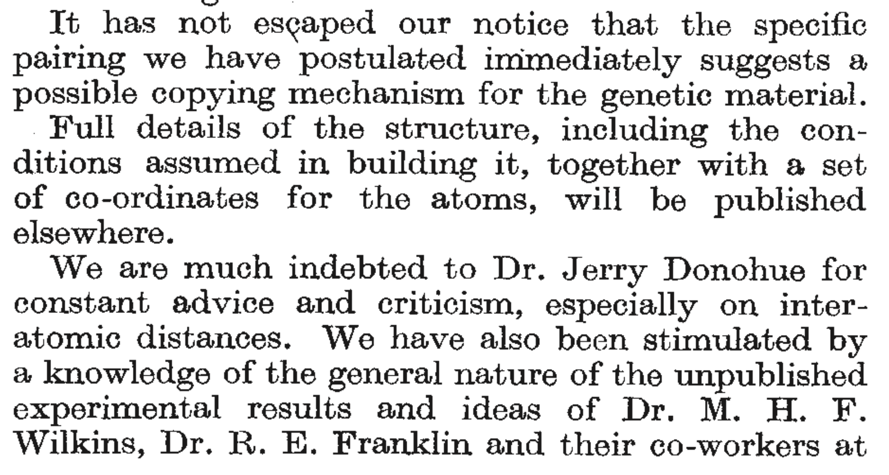

# DNA Sequences and Sequencing

To understand the fundamentals of alignment of DNA sequence to a reference
genome, and all the intricacies that such a process entails, it is important
to know a few important facts about DNA and how the sequence of a DNA molecule
can be determined. This section may be review for some, but it presents the minimal
set of knowledge needed to understand how DNA sequencing works, today.


## DNA Stuff

In bioinformatics, we are primarily going to be interested in representing DNA molecules
in text format as a series of nucleotide bases (A, C, G, T).  For the most part, we don't want
to stray from that very simple representation; however, it is important to understand a
handful of things about _DNA directionality_ and the action of DNA polymerase during the 
process of _DNA replication_ to understand next generation sequencing and DNA alignment
conventions.  

DNA typically occurs as a double-helix of two _complementary_ strands.  Each strand is composed of a
_backbone_ of phophates and deoxyribose molecules, to which DNA _bases_ are attached.  Figure \@ref(fig:dna-structure) shows this for a fragment of _double-stranded_ DNA of four nucleotides.
```{r dna-structure, echo=FALSE, fig.align='center', dpi=80, fig.cap='Schematic of the structure of DNA. (Figure By Madprime (talk---contribs)  CC BY-SA 3.0, https://commons.wikimedia.org/w/index.php?curid=1848174)'}
knitr::include_graphics("figs/DNA_chemical_structure.svg")
```
The orange parts show the ribose molecules in the backbone, while the four remaining colors
denote the nucleotide bases of adenine (A), cytosine (C), guanine (G), and thymine (T).  Each base
on one strand is associated with its _complement_ on the other strand.  The hydrogen bonds between
complements is what holds the two strands of DNA together.  A and T are complements, and 
C and G are complements.  (I remember this by noting that C and G and curvy and A and T are sharp and
angular, so the pairs go together...).

Immediately this raises two challenges that must be resolved for making a simple,
text-based representation of DNA:

1. When describing a sequence of DNA bases, which direction will we read it in?
2. Which strand will we read off of?

We leave the second question until later.  But note that the order in which DNA sequence
is read is, by convention, from the 5' to the 3' end of the molecule.  The terms 3' and 5' 
refer to different carbon atoms on the ribose backbone molecules.  In the figure above,
each little "kink" in the ribose molecule ring (and in the attached lines) is a carbon molecule.
If you count clockwise from the oxygen in ribose, you see that the third carbon (the 3' carbon) is the
carbon atom that leads to a phosphate group, and through the phosphate, to an attachment with the
5' carbon atom of the next ribose.  The 3' and 5' carbon atoms are labelled in red
on the top-left ribose molecule in Figure \@ref(fig:dna-structure).

Notice that when we speak of reading a DNA sequence, we are implicitly talking about
reading the sequence of one of the two strands of the double-stranded DNA molecule.
I'll say it again: a DNA sequence is always the sequence of one _strand_ of the molecule.
But, if that DNA were "out living in the wild" it would have been in double-stranded
form, and would have been paired with its complement sequence.  For now, just note
that any DNA sequence always has a complement which is read in the reverse direction.
Thus, if we have a sequence like:
```
5'--ACTCGACCT--3'
```
Then, paired with its complement it would look like:
```
5'--ACTCGACCT--3'
    |||||||||
3'--TGAGCTGGA--5'
```
and, if you were to write its complement in standard 5' to 3' order,
you would have to reverse it like so:
```
5'--AGGTCGAGT--3'
```


### DNA Replication with DNA Polymerase

So, why do we read DNA sequence from 5' to 3'?  Is it just because geneticists are wacky, backwards
folks and thought it would be fun to read in a direction that sounds, numerically, to be
backwards? No! It is because $5'\longrightarrow 3'$ is the direction in
which a new strand of DNA is
synthesized during DNA replication.

When @watsonMolecularStructureNucleic1953 published the first account of the double helical structure of DNA, 
they noted that the double-helix (i.e., two-stranded) nature of the molecule immediately suggested
a copying mechanism (Figure \@ref(fig:crickwat)).
```{r crickwat, echo=FALSE, fig.align='center', dpi=80, fig.cap='Excerpt from Crick and Watson (1953).'}

```
(I've also included, in the excerpt, the inadequate acknowledgment
of the centrality of Rosalind Franklin's pioneering
X-ray crystallography results to Crick and Watson's conclusions---an issue in scientific history about
which much has been written, see, for example, this [article](https://www.theguardian.com/science/2015/jun/23/sexism-in-science-did-watson-and-crick-really-steal-rosalind-franklins-data) in _The Guardian_.)

Figure \@ref(fig:dna-copying) shows a schematic of what DNA looks like during the replication process.
```{r dna-copying, echo=FALSE, fig.align='center', dpi=80, fig.cap='DNA during replication. (Figure adapted from the one by Madprime (talk---contribs)  CC BY-SA 3.0, https://commons.wikimedia.org/w/index.php?curid=1848174)'}
knitr::include_graphics("figs/DNA_chemical_structure_2.svg")
```
Essentially, during DNA replication, a _DNA polymerase_ molecule finds nucleotide bases (attached
to three phoshpate groups) to build a new strand
that is complementary to the DNA _template_ strand, and it guides
those _nucleotide triphosphates_ to the appropriate
place in the complementary strand and helps them be incorporated into that growing,
complementary strand.  The newly syntesized strand is a
_reverse complement_ of the template strand. However, DNA polymerase is not capable of
"setting up shop" anywhere upon a template strand and simply stuffing complementary bases
in wherever it wants.  In fact, DNA polymerase is only able to add new
bases to a growing strand if it can attach the new nucleotide triphosphate to a _free 3' hydroxyl_
that is on the end of the growing strand (the 3' hydroxyl is just a hydroxyl
group attached to the 3' carbon).  In Figure \@ref(fig:dna-copying), the template
strand is the strand on the right of the figure, and the growing complementary strand
is on the left side.  There is a free 3' hydroxyl group on the ribose attached to the cytosine
base.  That is what is needed for DNA polymerase to be able to place a
thymine triphosphate (complementary to adenine on
the template strand) in the currently vacant position.  If that thymine comes with a free
3' hydroxyl group, then DNA polymerase will next place a guanine (complementary to the
cytosine on the template strand) on the growing chain.  And so forth.  Thus, we see
how the new strand of DNA is synthesized from the 5' to the 3' end _of the growing chain_.

Of course, some people find it easier to think about a new strand of DNA being sythesized in
the 3' to 5' direction _along the template strand_.  This is equivalent.  However, if you just remember
that "free three" rhymes, and that DNA polymerase needs a free 3' hydroxyl to add a new base
to the growing strand, you can always deduce that DNA must "grow" in a 5' to 3' direction.

### The importance of the 3' hydroxyl...

It would be hard to overstate the importance to molecular biology
of DNA polymerase's dependence upon
a free 3' hydroxyl group for new strand synthesis. This simple fact plays a central
role in:

1. polymerase chain reaction (PCR)---the PCR primers are little oligonucleotides
that attach to a template strand and provide a free 3' hydroxyl group for the initiation
of synthesis.
2. a ddNTP is a nucleotide attached to a ribose molecule
that lacks a hydroxyl group on its 3' carbon.  Incorporation of
such a ddNTP into a growing DNA strand terminates further DNA extension, and forms
the basis for Sanger sequencing (we'll explore this below).
3. Some medications are designed to interfere with viral DNA replication.  For example,
AZT, or azino-thymine, is an anti-retroviral drug used to slow the progression of AIDS.
It is a thymine nucleotide with an azino ($\mathrm{N}_3$) group (instead
of a hydroxyl group) attached to the 3' carbon.  Azino-thymine is used preferentially
by reverse transcriptase when synthesizing DNA.  Incorporation of it into a growing
chain terminates DNA synthesis.

The reversible inhibition of DNA extension also plays an important role in
sequencing by synthesis as used by Illumina platforms.  We will discuss
this in a moment, but first we take a stroll down memory lane to refresh our
understanding of _Sanger sequencing_ so as to understand how radically different
_next-generation sequencing_ technologies are.

## Sanger sequencing

It is hard to imagine that the first public human genome was sequenced almost
entirely by Sanger sequencing.  We discuss the Sanger sequencing method
here so we can contrast it with what happens on, say, an Illumina machine
today.

To perform Sanger sequencing, first it was necessary to do PCR to 
create numerous copies of a double stranded DNA fragment that was to be
sequenced.  For example let's say that one wanted to sequence the
20-mer shown below, represented  as double stranded DNA.
```
5'--AGGCTCAAGCTTCGACCGT--3'
3'--TCCGAGTTCGAAGCTGGCA--5'
```
For Sanger sequencing, first, one would do PCR to create
bazillions of copies of that double-stranded DNA. Then four separate further PCR
reactions would be done, each one having been "spiked" with a little bit of
one of four different ddNTPs which, if incorporated into the
growing strand allow no further extension of it.

For example, if PCR were done as usual, but with the addition of ddATP,
then occasionally, when a ddATP (an A lacking a 3' hydroxyl group)
is incorporated into the growing strand that strand will grow no more.
Consequently, the products of that PCR (incorporating an appropriate
concentration of ddATPs), once filtered to retain only
the top strand from above, will include the fragments
```{r, echo=FALSE}
#' @param seq the strand of DNA complementary to the one you are trying to sequence
#' @param dd the dd-terminating base
terminate_dna <- function(seq = "AGGCTCAAGCTTCGACCGT", dd = "A") {
  ret <- list()
  n <- 0
  for (i in 1:nchar(seq)) {
    if (stringr::str_sub(seq, i, i) == dd) {
      n <- n + 1
      ret[[n]] <- stringr::str_c(stringr::str_sub(seq, 1, i), "*")
    }
  }
  unlist(ret)
}
terminate_dna(dd = "A")
```
Where the `*` follows the sequence-terminating base.  

Likewise, in a separate reaction, occasional incorporation of a ddCTP will yield products:
```{r, echo=FALSE}
terminate_dna(dd = "C")
```
And in another reaction, occasional incorporation of ddGTP yields:
```{r, echo=FALSE}
terminate_dna(dd = "G")
```
And in a final, separate reaction, incorporation of ddTTP would give:
```{r, echo=FALSE}
terminate_dna(dd = "T")
```

Each of these fragments is of a different length, so they can be
separated on an electrophoretic gel.  The secret to Sanger sequencing is that
the products of all four separate reactions can be run side by side in
separate lanes of the gel (or, as was done later, in separate capillaries...),
so that the gel, with small
fragments running faster than large fragments, from the top to the bottom
of the gel, would look like Figure \@ref(fig:sanger):
```{r sanger, echo=FALSE, message=FALSE, fig.cap='Stylized gel from Sanger sequencing. DNA migrates downward from the top, with smaller fragments traveling further than longer fragments. The four differnent lanes corresponds to four different PCR reactions incorporating ddNTPs of different types, as denoted below the x axis.'}
sstib <- list(
  ddATP = tibble(frags = terminate_dna(dd = "A")),
  ddCTP = tibble(frags = terminate_dna(dd = "C")),
  ddGTP = tibble(frags = terminate_dna(dd = "G")),
  ddTTP = tibble(frags = terminate_dna(dd = "T"))
) %>%
  bind_rows(.id = "ddNTP")

ggplot(sstib, aes(x = ddNTP, y = nchar(frags))) + 
  geom_text(aes(label = frags), size = 2.2) +
  theme_bw() +
  theme(panel.grid.major = element_blank(), 
        panel.grid.minor = element_blank(), 
        axis.title.y = element_blank(), 
        axis.text.y = element_blank()) +
  geom_rect(aes(xmin = as.integer(factor(ddNTP)) - 0.4, 
                xmax = as.integer(factor(ddNTP)) + 0.4,
                ymin = nchar(frags) - 0.4,
                ymax = nchar(frags) + 0.4), 
            fill = NA, colour = "black")
         
```

In reality, a gel like that in Figure \@ref(fig:sanger), won't bear the name of each
sequence fragment.  In fact, it will look much more like what you see in Figure \@ref(fig:sanger2).
```{r sanger2, echo=FALSE, message=FALSE, fig.cap='Stylized gel from Sanger sequencing. Here, the DNA sequence of each band cannot be seen.'}

ggplot(sstib, aes(x = ddNTP, y = nchar(frags))) + 
  geom_text(aes(label = frags), size = 2.2) +
  theme_bw() +
  theme(panel.grid.major = element_blank(), 
        panel.grid.minor = element_blank(), 
        axis.title.y = element_blank(), 
        axis.text.y = element_blank()) +
  geom_rect(aes(xmin = as.integer(factor(ddNTP)) - 0.4, 
                xmax = as.integer(factor(ddNTP)) + 0.4,
                ymin = nchar(frags) - 0.4,
                ymax = nchar(frags) + 0.4), 
            fill = "black", colour = "black")
         
```
However, even with the DNA fragemnt sequences obscured, their sequences can be
detemined by working from the bottom to the top and adding a different DNA base according to which column the band is in. Try it out.

Some very important points must be made about Sanger sequencing:

1. The signal obtained from sequencing is, in a sense, a mixture of the starting templates.  So, if you 
have DNA from an individual, you have two copies of each chromosome, and they might carry slightly
different sequences.  At heterozygous sites, it is impossible to tell which allele came from which
chromosome.
2. To conduct this procedure, it was typical that specific PCR primers were used to sequence
only a single fragment of interest.  Extending the sequencing beyond that region often involved
a laborious process of "walking" primers further out in either direction.  Very tedious.
3. Each sequencing reaction was typically carried out for just a single individual at once.  
4. Until a little over a decade ago, this is how sequencing was done in conservation genetics.


## Illumina Sequencing by Synthesis

Illumina paired-end sequencing is currently the leading technology in conservation
genomics. 

They say that a picture is worth a thousand words, so a video may well be worth
ten thousand.  Illumina has a very informative video about sequencing by synthesis.


I have used some code (I found on GitHub) to provide captions to the video. These captions
include comments, as well as questions that form part of this week's homework. (Yay!)  
You can see the video at
[https://eriqande.github.io/erics-captioned-vids/vids/illumina-sbs/](https://eriqande.github.io/erics-captioned-vids/vids/illumina-sbs/)


The main take-home messages I want everyone to get about Illumin sequencing is:

1. The signal obtained from each cluster is the sequence of a single, _single-stranded DNA fragment_
1. In paired-end sequencing, sequence from both ends of the fragment (but not necessarily
the middle) is obtained.
2. The technique lends itself to sequencing millions of "anonymous" chunks of DNA.
3. The indexes, or "barcodes" allow DNA from multiple individuals to be sequenced in a single run.
4. This is how most high-throughput sequencing is done today.

## Library Prep Protocols

Gotta mention here about how barcodes work.

How you prepare your libraries dictates what type of data you get.

### WGS

### RAD-Seq methods

### Amplicon Sequencing

### Capture arrays, RAPTURE, etc.